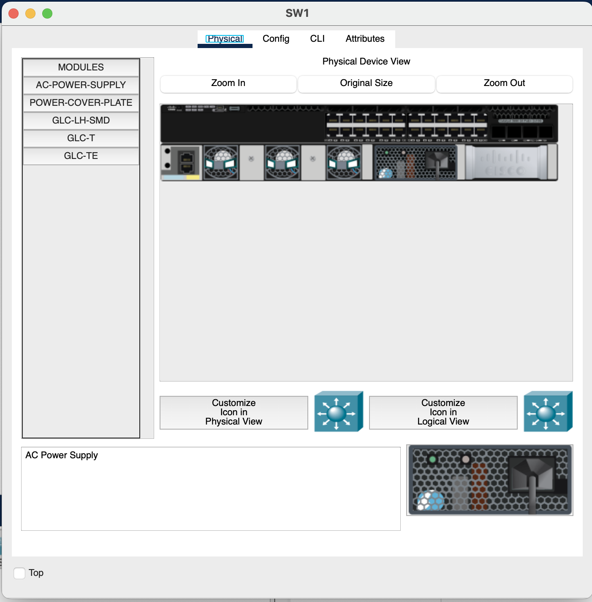
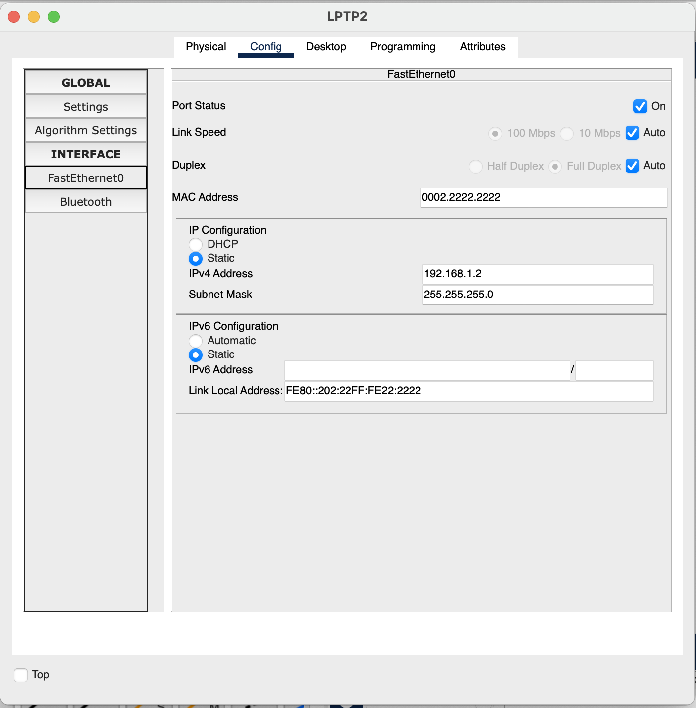
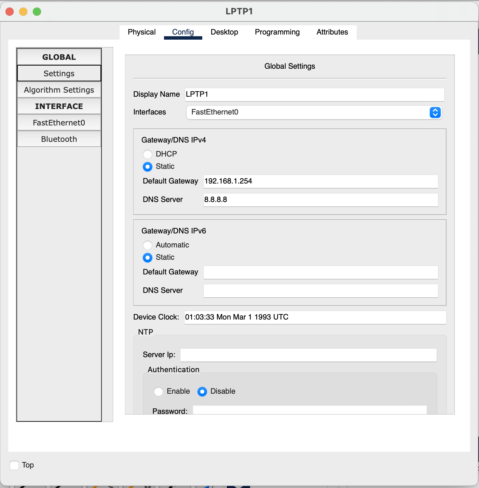
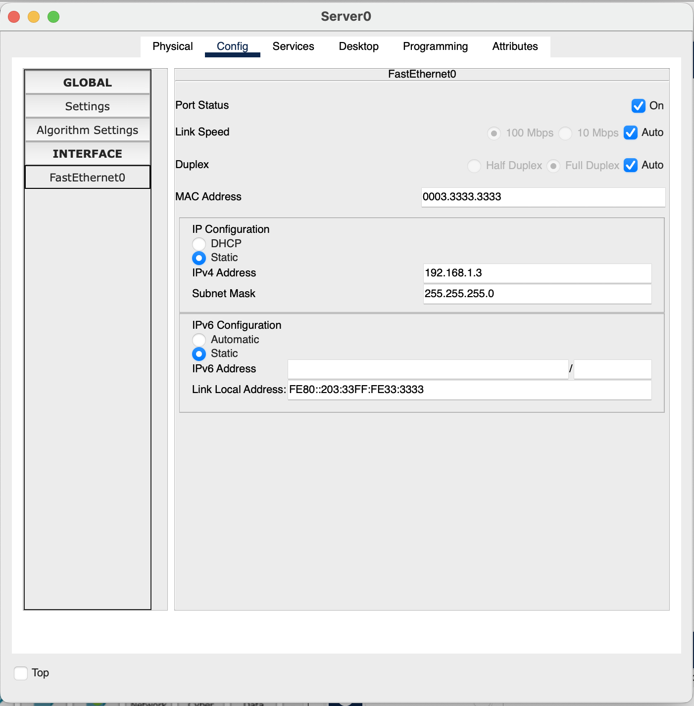
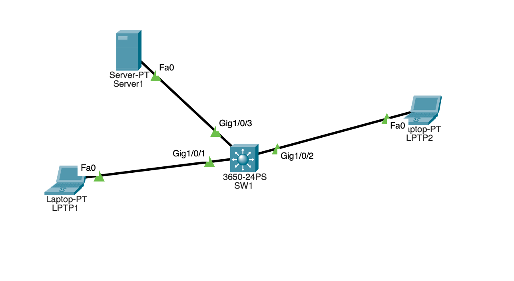
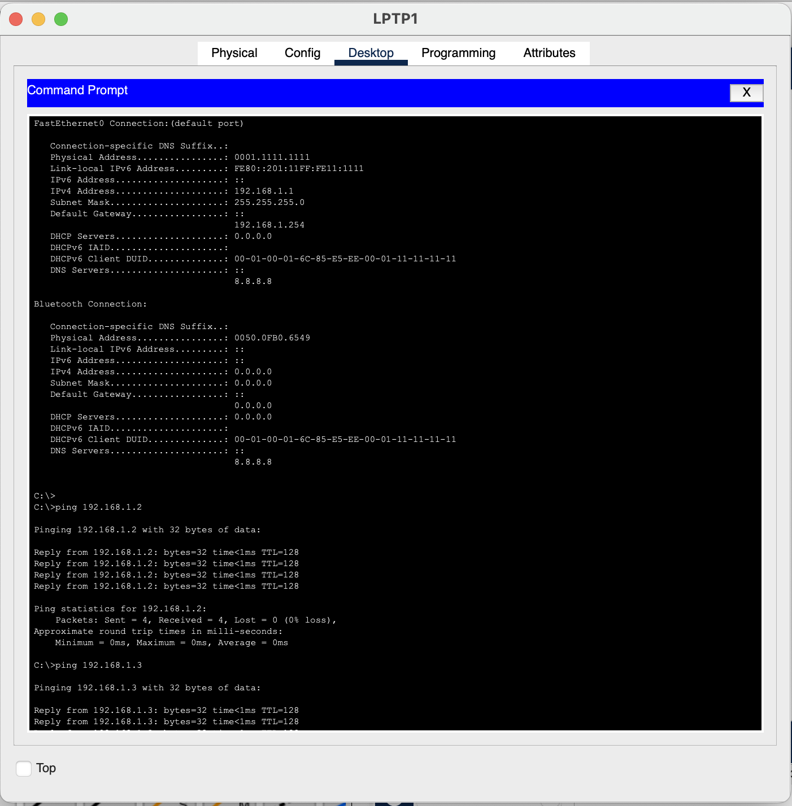
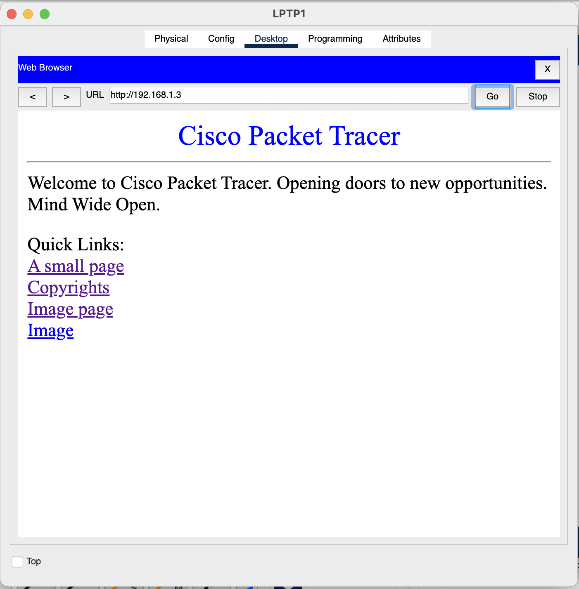

# Lab 01: Create a Basic Network

### Objective
Configure one multilayer switch, two end devices (in this case, two laptops), and a server hosting a web server. Ensure that each end device, including the server, can communicate with one another using ping commands, and that the web server is viewable via a browser.

### Step 1: Configure Multilayer Switch
After realizing that packet tracer won't let you do anything with devices unless they are powered on (lol), I placed a single AC power supply module into a 3650-24PS switch, then switching it's label to *SW1*. For now, I'm not configuring the switch any further as this should be enough for the time being. In other lab, I'll try and configure the switch to have things like VLAN support and the such.

### Step 2: Configure End Devices
Using two laptops, I went ahead and gave each of them their own unique MAC address, IPV4 address, subnet mask, default gateway, and DNS server. As far as I understand: 
1. The MAC address that is generated by packet tracer is good enough, but changing it to something simple and unique to the device makes it easier to identify later on when doing stuff, for example, with ARP.
2. The static IPV4 address given to each end device is within the 192.168.1.X/24 subnet. 
3. The default gateway should not matter right now since we do not have a router configured in our network, but nonetheless I just configured it to the IPV4 address of 192.168.1.254.
4. Similarly to the default gateway configuration, the DNS server being configured to 8.8.8.8 should not have an effect on this lab for now, but may in a later one. How I see it; better to configure it now and not forget about it.

Laptop 1 (*LPTP1*):

Laptop 2 (*LPTP2*):

Global Settings (Applies to All End Devices):

### Step 3: Configure Server
Do the same steps as the laptops, but now ensuring that the web server service is working. To do this, you just have to ensure that the server has HTTP and HTTPS turned on. 

Server (*Server1*):

### Step 4: Connect Each Device to the Multilayer Switch and Test
Using Copper Straight-Through cables (Ethernet Cables), connect each end device from their FastEthernet0 port (Fa0) to the switch's corresponding ethernet ports. In this instance, *LPTP1* connected to GigabitEthernet1/0/1 (Gig1/0/1), *LPTP2* connects to GigabitEthernet1/0/2 (Gig1/0/2), and so on. 

Current Network Topology:

Once all devices are connected, we can test if everything is working by going onto one device and pinging another, while also ensuring that the web server is running by using the browser function on any device that is not the server. 

Testing Network via *LPTP1*:

Testing Network via *LPTP2*:

Testing Web Server Running on Network via *LPTP1**:

> [!NOTE]
> This method of testing works the same way across both *LPTP1* and *LPTP2*

### Final Comments
Everything seems to be going smoothly right now, but I know for a fact that it'll just get more complicated the more I want to add/do. My plan, hopefully, is to recreate my current home network setup using packet tracer, from VLANs to specific firewall rules. Don't really know if that'll be something I end up doing, but it would be cool to do something like it. 